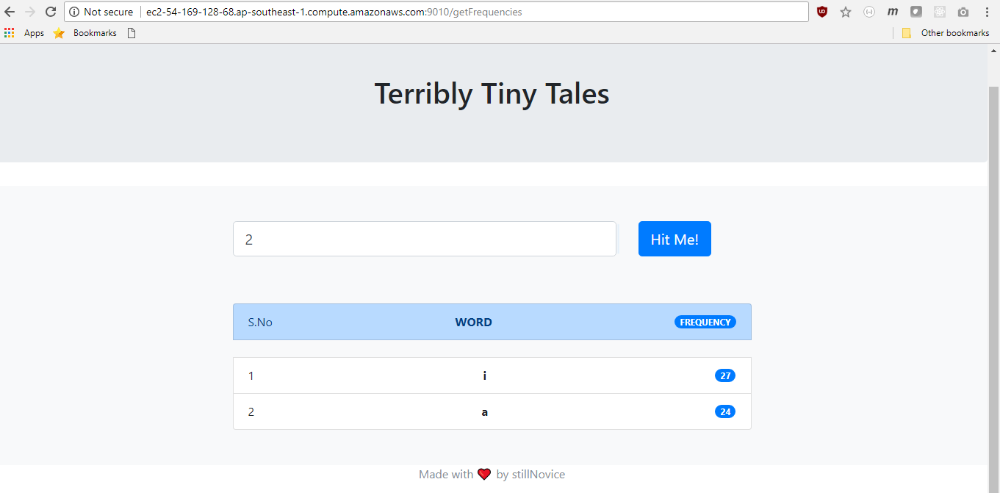
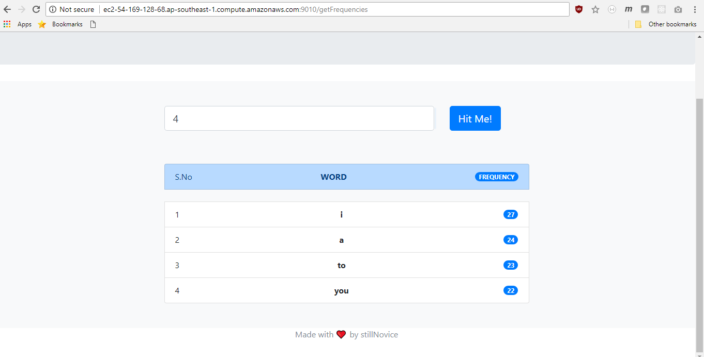
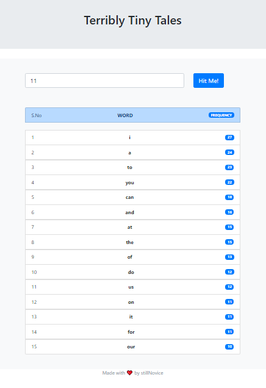
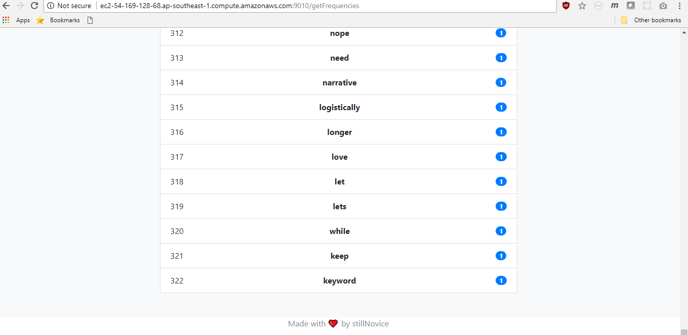
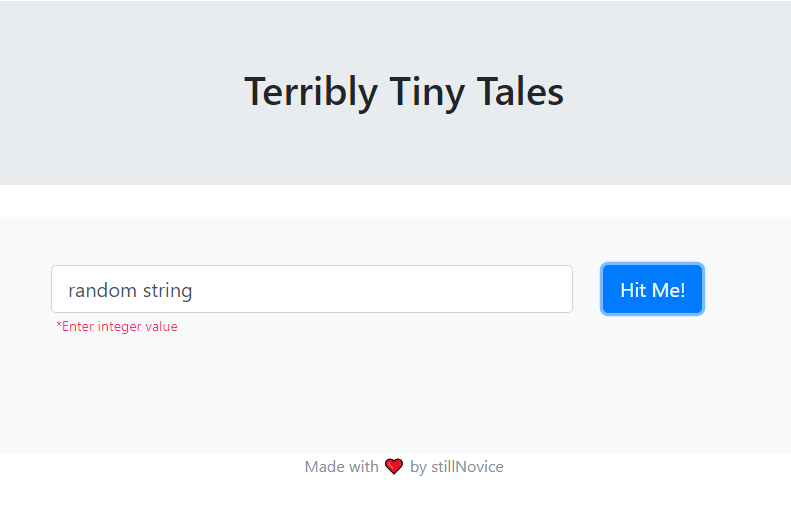

# TTT
This is an assignment.

# Installation
### Windows
```sh
$ git clone https://github.com/stillNovice/ttt-assignment.git
$ cd ttt-assignment
$ npm install
$ npm start

```

### Linux
```sh
$ git clone https://github.com/stillNovice/ttt-assignment.git
$ cd ttt-assignment
$ npm install
$ sudo npm install -g babel-cli
$ node src/app.js

```

# Usage
1. Open Chrome
2. Go to localhost:9010
3. Enter N and enjoy.

  OR

visit the URL: http://ec2-54-169-128-68.ap-southeast-1.compute.amazonaws.com:9010/

# Components
 ## Front-End
  - Express-Handlebars as templating engine.
  - Bootstrap for styling.
  - jQuery for DOM manipulation.
  - Good old HTML & CSS.
 
 ## Back-End
  - Node.js - Javascript run time.
  - Express.js - Web application framework for building the api's. Here I have exposed an endpoint '/getFrequencies' to get top N frequency words in the text file.
  - Axios.js - HTTP client to get the contents of the text file stored at remote location.

 ## Solution to the problem
  - **I have used Trie to build up the dictionary**. The reason is if at the time of scaling the app, its easy to add words in Trie and the time-complexity is O(max(length of a word)). Also the lookup cost is the same. Also by using Trie, the space complexity is much minimised when compared to the solutions including map or set (which are also viable solutions).
  - Every node of the Trie is storing the frequency of words(words) ending at that node, the Character the node represents(data), and the children nodes(children).
  - Once my dictionary is ready, I am getting the frequencies of all unique words by just traversing the whole Trie once and sorting the result on the basis of the frequencies.

  # Screenshots
  ## N = 2
  

  ## N = 4
  

  ## N = 11
  

  ## N = MAX
  
  
  ## N = String
  